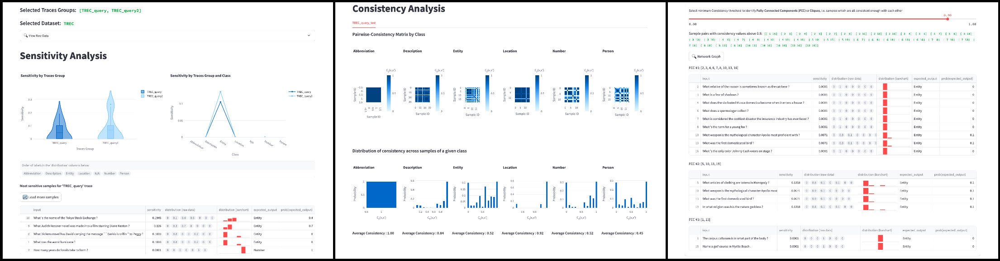

# LLMs Sensitivity & Consistency (NAACL 2025)

This is the official repository of the [NAACL 2025 paper](https://arxiv.org/abs/2406.12334) _"What Did I Do Wrong? Quantifying LLMs’ Sensitivity and Consistency to Prompt Engineering"_.

### Citing our work

If you found our metrics useful, please cite our work:
```
@inproceedings{errica_what_2025,
  author    = {Federico Errica and
               Giuseppe Siracusano and
               Davide Sanvito and
               Roberto Bifulco},
  title     = {What Did I Do Wrong? Quantifying LLMs’ Sensitivity and Consistency to Prompt Engineering},
  booktitle = {Proceedings of the 2025 Annual Conference of the North American Chapter of the Association for Computational Linguistics: Human Language Technologies (NAACL)},
  year      = {2025},
}
```

The code to reproduce our results is provided in the [paper](paper/README.md) directory.

This repository includes **LLMetrics**, a Python package to easily measure the *Sensitivity* and *Consistency* in your GenAI applications. This package is based on [Langfuse](https://langfuse.com/), a SOTA tool for LLM observability.

The *Sensitivity* metric quantifies the changes of predictions across rephrasings of the prompt.
It can be used to compare the "robustness" of different LLMs to variations of the promps.
Notably, it does not require access to ground truth labels and can be used to find "problematic"
samples, revealing LLMs’ weak spots.

The *Consistency* metric measures how predictions vary across rephrasings for elements of the same class.
Consistency finds sample groups misclassified similarly.
Tuning prompts to large groups offers cost-benefit trade-offs.

More details are provided in our [NAACL 2025 paper](https://arxiv.org/abs/2406.12334).

# 1. Installation

## 1.1 Pre-requisites

### Python 3.12 and Poetry

LLMetrics uses Python 3.12: ensure you have it on your system or run run the following commands

```sh
# sudo apt install software-properties-common # (if `add-apt-repository` is not found)
sudo add-apt-repository ppa:deadsnakes/ppa
sudo apt install -y python3.12
```

This project dependencies are managed with poetry.
To install poetry we suggest using [pipx](https://pipx.pypa.io/stable/installation/)

```sh
sudo apt update
sudo apt install -y pipx
pipx ensurepath
```

Then, we are ready to install [poetry](https://python-poetry.org/docs/)
```sh
pipx install poetry
```

### Langfuse

We suggest to run Langfuse locally via docker compose following the [official documentation](https://langfuse.com/self-hosting/local). If needed, [other deployment options](https://langfuse.com/self-hosting#deployment-options) are available.

Once installed, open the Langfuse Dashboard and create a new project.

- Click on "Sign up" (notice that no real email address is required when using a local deployment)
- Click on "New Organization" and provide an "Organization Name"
- Proceed with "Create"
- Optionally invite additional members to the organization
- Proceed with "Next"
- Provide a "Project name"
- Proceed with "Create"
- Copy the configuration in the `.env` file: i.e. `LANGFUSE_PUBLIC_KEY`, `LANGFUSE_SECRET_KEY` and `LANGFUSE_INTERNAL_HOST` values.

[!] An example of `.env` file is provided in `.env.sample`.

## 1.2 Install LLMetrics

Clone this repository and run `poetry install`.

```sh
# git clone https://github.com/nec-research/sensitivity-consistency-LLM.git
# cd sensitivity-consistency-LLM
poetry install
```

# 2. How to measure Sensitivity and Consistency

This quick HOW-TO shows how with few lines of code you can add Sensitivity and Consistency measures to your GenAI development pipeline.

A fully working example is provided in the Jupyter notebook [example.ipynb](notebooks/example.ipynb).

[!] Before running the code, you must configure the OpenAI API key and Langfuse secrets in the `.env` file (an example is provided in `.env.sample`).

## 2.1 Implement your GenAI based classifier

The following example is based on [Instructor](https://python.useinstructor.com/), an open-source framework for structured output generation with LLMs.

```python
class Labels(str, enum.Enum):
    """Enumeration for single-label
    text classification."""
    NUM = "Number",
    DESC = "Description",
    ENTY = "Entity",
    ABBR = "Abbreviation",
    LOC = "Location",
    HUM = "Person",


class SinglePrediction(BaseModel):
    """
    Class for a single class label prediction.
    """
    class_label: Labels


def classify(prompt: str,  user_input: str, model: str = "gpt-4o-mini") -> Labels | None:
    labels_list = ['Number', 'Location', 'Person', 'Description', 'Entity', 'Abbreviation'] 
      
    client = instructor.from_openai(OpenAI())
    
    try:
        response = client.chat.completions.create(
            model=model,
            messages=[{"role": "user", "content": f"{prompt} \n {user_input}"}],
            response_model=SinglePrediction,  
            max_retries=3,
        )
    except Exception as e:
        print(
            f"Error {type(e).__name__} exception: {str(e)}"
        )
        return None
    
    return response
```

## 2.2 Add Sensitivity & Consistency Metadata to your tracing system

By adding the following lines, we can easily keep track of the metadata required to compute the Sensitivity and Consistency metrics.
We currently support Langfuse as framework for LLM Observability.

Notice that we provide an explicit `classify` name to later identify the traces in Langfuse.

```diff

+ @observe(name="classify")
def classify(prompt: str,  user_input: str, model: str = "gpt-4o-mini") -> Labels | None:
    labels_list = ['Number', 'Location', 'Person', 'Description', 'Entity', 'Abbreviation'] 
      
    client = instructor.from_openai(OpenAI())
    
    try:
        response = client.chat.completions.create(
            model=model,
            messages=[{"role": "user", "content": f"{prompt} \n {user_input}"}],
            response_model=SinglePrediction,  
            max_retries=3,
        )
    except Exception as e:
        print(
            f"Error {type(e).__name__} exception: {str(e)}"
        )
        return None
    
+    SensitivityConsistencyMetrics.append_sensitivity_metadata_to_trace(
+        prompt,
+        SinglePrediction,
+        user_input,
+        response.class_label,
+        labels_list,
+        model,
+        langfuse_context
+    )
    
    return response
```

The `append_sensitivity_metadata_to_trace()` method supports the following parameters:
```
- prompt: prompt string used to query the LLM
- response_model: # TODO make this field optional 
- user_input: input to be classified
- response.class_label: parsed output 
- labels_list: list of possible labels
- model: LLM model 
- langfuse_context: Langfuse context object
```

### 2.3 Test your classifier and experiment with different prompts

At this point you can start to run your classifier against different input samples...

```python
test_inputs = [
    'How far is it from Denver to Aspen ?',
    'What county is Modesto , California in ?',
    'Who was Galileo ?',
    'What is an atom ?',
    'When did Hawaii become a state ?',
    'How tall is the Sears Building ?',
    'George Bush purchased a small interest in which baseball team ?',
    "What is Australia 's national flower ?",
    'Why does the moon turn orange ?',
    'What is autism ?'
]

prompt_1 = 'Classify the questions based on whether their answer type is a Number, Location, Person, Description, Entity, or Abbreviation.'
for t in test_inputs:
    print(t)
    result = classify(prompt_1,t)
    print(result)
```

...and to experiment with different prompts.
Every developer knows very well that experimenting with different prompts can be a long process!

```python
prompt_2 = 'Determine the answer type for each question: Number, Location, Person, Description, Entity, or Abbreviation.'

for t in test_inputs:
    print(t)
    result = classify(prompt_2,t)
    print(result)
```

Finally, you can complete your tests with the latest prompt variation.

```python
prompt_n = 'Categorize the questions based on whether their answers are classified as a Number, Location, Person, Description, Entity, or Abbreviation.'

for t in test_inputs:
    print(t)
    result = classify(prompt_n,t)
    print(result)
```

## 2.4 Compute the Metrics

After having played with different inputs and different prompts, we can finally proceed to the actual computation of the two metrics.

### 2.4.1 Compute Sensitivity Metric

Starting from the previously collected traces (with name `classify`), we can simply compute the Sensitvity as follows:

```python
from llmetrics.langfuse_adaptor import SensitivityConsistencyMetrics

metrics = SensitivityConsistencyMetrics(trace_name='classify')
traces = metrics.fetch_traces()
sensitivity = metrics.compute_sensitivity(traces)
sensitivity
```

## 2.4.2 Compute Consistency Metric

The computation of the Consistency requires the availability of labeled data.
Notice that such labels can be added a posteriori to the traces, i.e. you can even potentially label just a subset your data while looking at the sensitivity analysis.

### Create a labeled dataset

The following code can be used to upload the dataset to Langfuse.

```python
from langfuse import Langfuse

langfuse = Langfuse(
            secret_key=os.getenv('LANGFUSE_SECRET_KEY'),
            public_key=os.getenv('LANGFUSE_PUBLIC_KEY'),
            host=os.getenv('LANGFUSE_INTERNAL_HOST'),
        )

langfuse.create_dataset(
    name="test_dataset",
)

test_output = [
    'Number',
    'Location',
    'Person',
    'Description',
    'Number',
    'Number',
    'Person',
    'Entity',
    'Description',
    'Description'
]

for t,o in zip(test_inputs, test_output):
    langfuse.create_dataset_item(
        dataset_name="test_dataset",
        input=t,
        expected_output=o,
    )
```

### Compute Consistency Metrics

```python
consistency, consistency_matrix = metrics.compute_consistency(traces, dataset_name="test_dataset")
```

# 3. How to visualize Sensitivity and Consistency

We provide a Web GUI, based on the [Streamlit](https://streamlit.io/) framework, to visualize the two metrics and analyse the results of the experiments.




```bash
# cd sensitivity-consistency-LLM
cd webui
./start_streamlit_server.sh
```

The Web GUI is then available at [http://localhost:8501](http://localhost:8501), using the default Streamlit port 8501.

## 3.1 Load data from Langfuse

Select *Start Date* and *End Data*, and click on *[Load data from Langfuse]* button.

The Web GUI provides a list of available traces names (e.g. `classify` used in the example of Section 2): select one or more traces.

It also provides a list of available Languse Datasets: optionally select one.
Although optional, a valid Langfuse Dataset is required to compute Consistency and Sensitivity split by Label.

Finally, click on *[Compute Metrics]*

By clicking on *[View Raw Data]* it is possible to manually inspect the raw data.

## 3.2 Sensitivity section

The Web GUI provides a plot for the Sensitivity, grouped by trace name.

If a valid Langfuse Dataset has been provided, it also split the data by label.

Then it shows for each trace name a list of the most sensitive samples.

Finally, it is possible to inspect a specific sample to investigate the distribution of the predicted classes and which specific prompt variants led to the different predictions.

## 3.3 Consistency section

For each class, the Web GUI provides the Pairwise-Consistency Matrix and the distribution of Consistency across samples of a given class.

Fixed a specific class, it is possible to analyse samples groups.
Specifically, the user can select a minimum Consistency threshold to identify samples which are all consistent enough with each other, i.e. which have a similar distribution of predicted labels.

